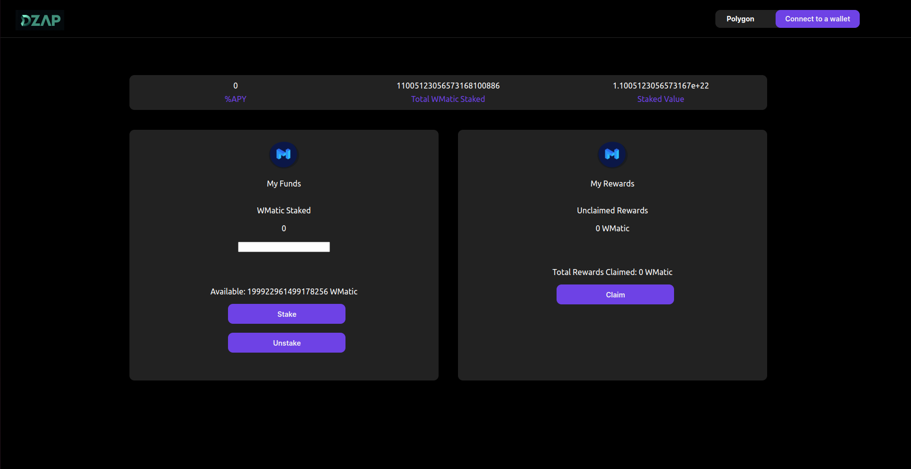

# DZapp Demo App

This is a staking app built with React. It allows users to connect their MetaMask wallet, stake, unstake, and claim their WMatic tokens. It is connected to a smart contract on the Polygon Mumbai testnet for staking functionality.

## Prerequisites

- [Node.js](https://nodejs.org/en/download/) installed.
- [MetaMask](https://metamask.io/download.html) browser extension installed and set up.

## Installation

1. Clone the repository:
    ```sh
    git clone https://github.com/IshitaSrivast/dzappdemo
    cd dzappdemo
    ```

2. Install the dependencies:
    ```sh
    npm install
    ```

3. Start the development server:
    ```sh
    npm start
    ```

The app should open in your default web browser. If not, navigate to [http://localhost:3000](http://localhost:3000).

## Usage

1. Click on the "Connect to a wallet" button to connect your MetaMask wallet.
2. Once connected, you can input the amount of WMatic you want to stake.
3. Click the "Stake" button to stake your tokens.
4. The "Unstake" button allows you to unstake your tokens.
5. You can also claim your rewards using the "Claim" button.

## Images


## Note

This app is configured to work with the Polygon Mumbai testnet. Make sure your MetaMask is connected to the correct network.

